## Instalasi Git

# Windows
Sebelum install Git di Windows, anda harus sudah mempunyai editor teks yang didukung oleh Windws. Editor yang bisa dipilih banyak, tetapi disarankan menggunakan Notepad++ atau Visual Studion Code atau Vim. Keberadaan editor teks ini akan menentukan keberhasilan instalasi (lihat langkah 5).

1. Setelah download Git, double click pada file yang di-download. Akan dimunculkan lisensi. Klik Next untuk lanjut.
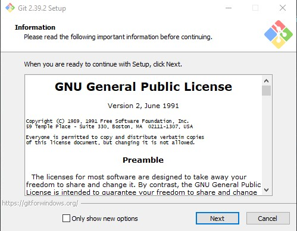
2. Setelah itu, pilih lokasi instalasi. Secara default akan terisi C:\Program Files\Git. Ganti lokasi jika memang anda menginginkan lokasi lain, klik Next
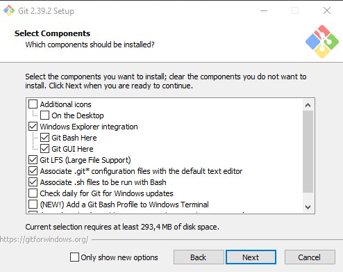
3. Pilih komponen. Tidak perlu diubah-ubah, sesuai dengan default saja. Klik pada Next.
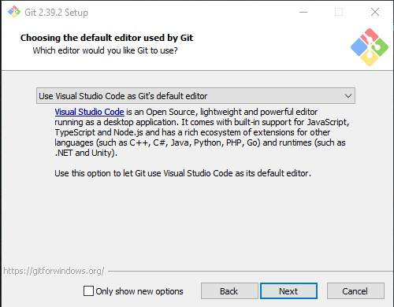
4. Mengisi shortcut untuk menu Start. Gunakan default (Git), ganti jika ingin mengganti - misalnya Git VCS.
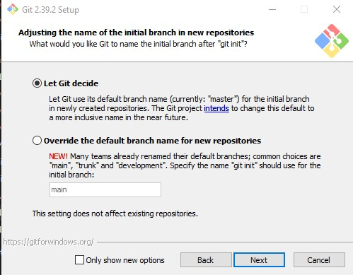
5. Pilih editor yang akan digunakan bersama dengan Git. Pada pilihan ini, digunakan Notepad++.Pilih editor yang akan digunakan bersama dengan Git. Pada pilihan ini, digunakan Notepad++.
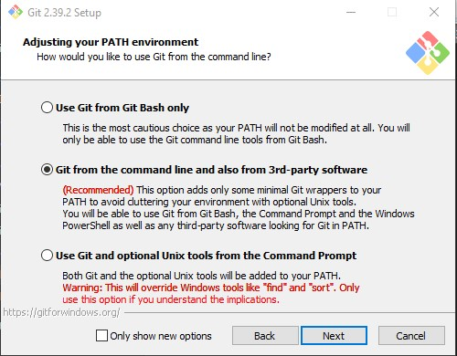
6. Pada saat instalasi, Git menyediakan akses git melalui Bash maupun command prompt. Pilih pilihan kedua supaya bisa menggunakan dari dua antarmuka tersebut. Bash adalah shell di Linux. Dengan menggunakan bash di Windows, pekerjaan di command line Windows bisa dilakukan menggunakan bash - termasuk ekskusi dari Git.
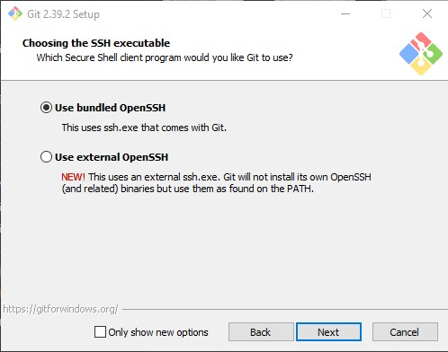
7. Pilih OpenSSL untuk HTTPS. Git menggunakan https untuk akes ke repo GitHub atau repo-repo lain (GitLab, Assembla).
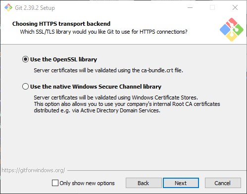
8. Pilih pilihan pertama untuk konversi akhir baris (CR-LF).
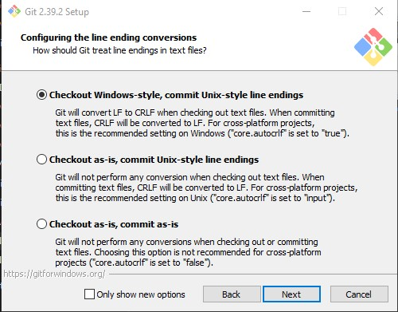
9. Pilih PuTTY untuk terminal yang digunakan untuk mengakses Git Bash.
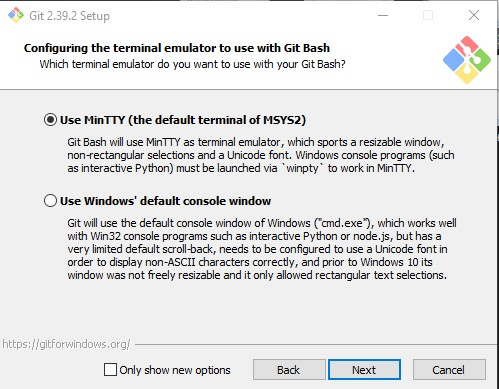
10. Untuk opsi ekstra, pilih serta aktifkan 1 dan 2.
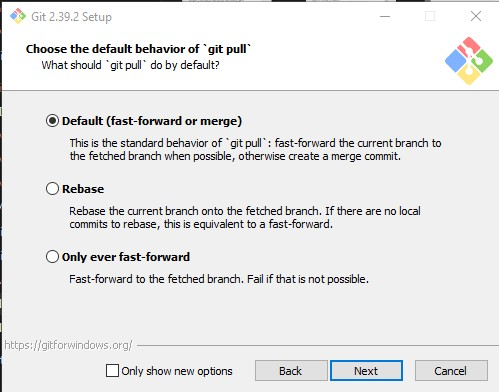
11. Setelah itu proses instalasi akan dilakukan.
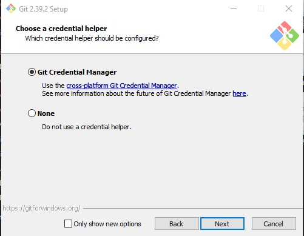
12. Jika selesai akan muncul dialog pemberitahuan. Klik pada Finish.
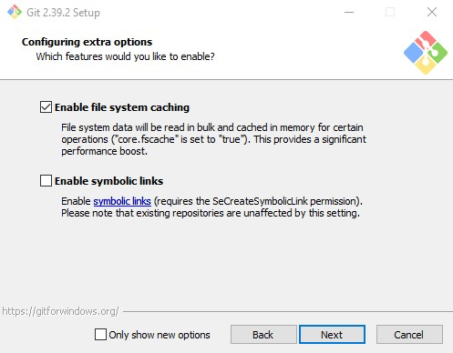
13. Untuk menjalankan, dari Start menu, ketikkan "Git", akan muncul beberapa pilihan. Pilih "Git Bash" atau "Git GUI".
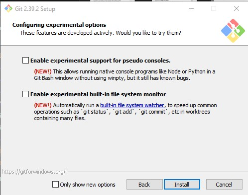
14. Tampilan jika akan menggunakan "Git Bash"
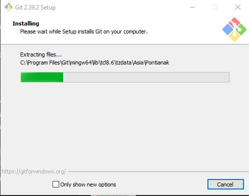
15. Tampilan jika akan menggunakan "Git GUI"
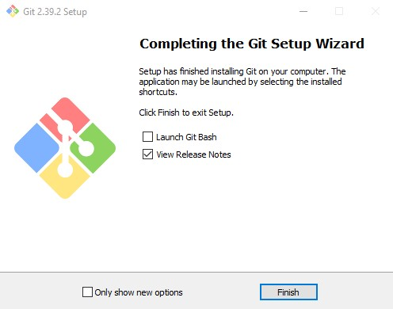
16. Untuk mencoba dari command prompt, masuk ke command prompt, setelah itu eksekusi "git --version" untuk melihat apakah sudah terinstall atau belum. Jika sudah terinstall dengan benar, makan akan muncul hasil berikut:

## Konfigurasi Git
Bagian ini merupakan seri tulisan tentang Git. Silahkan ke README.md untuk memahami gambaran garis besar materi-materi yang dituliskan.

Secara minimal, user harus memberitahu Git tentang username serta email yang digunakan setiap kali terjadi perubahan pada repo Git. Username serta email ini yang akan dimasukkan oleh Git ke catatan perubahan di repo. Di sistem operasi Linux atau sejanis (UNIX), konfigurasi ini nantinya akan disimpan di $HOME/.gitconfig. Untuk sistem operasi Windows, konfigurasi ini akan disimpan di C:\Document and Settings\NamaUser dengan nama file .gitconfig. Secara minimal, ada 2 hal yang perlu dikonfigurasi yaitu username dan email. Gunakan perintah berikut:
$ git config --global user.name "Nama Anda di GitHub"
$ git config --global user.email email@domain.tld
Isian di atas harus disesuaikan dengan nama serta email yang digunakan untuk mendaftar di GitHub. Untuk melihat konfigurasi yang sudah ada:

$ git config --list
user.email=phylossophie@gmail.com
user.name=Bambang Purnomosidi D. P.
color.ui=true
$
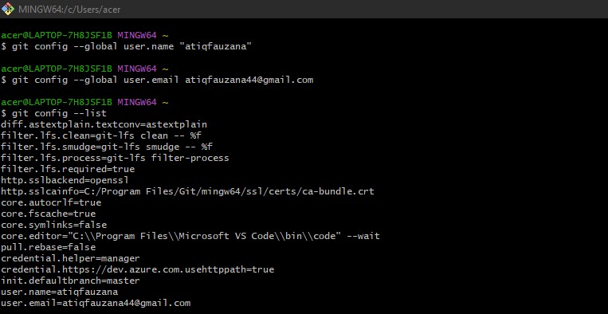
Langkah ini cukup dilakukan sekali saja, kecuali jika ingin melakukan perubahan nama dan email.

Bagian ini merupakan seri tulisan tentang Git. Silahkan ke README.md untuk memahami gambaran garis besar materi-materi yang dituliskan.

Sebagai pengguna Git dan GitHub, kita bisa mempunyai repository (sering disingkat dengan repo saja) di GitHub, baik untuk repo yang bersifat publik maupun bersifat privat. Jika ingin menggunakan repo yang bersifat privat (hanya bisa diakses oleh pemakai GitHub yang dikehendaki), maka kita harus membayar.

Suatu repo dimaksudkan untuk menyimpan aset digital (dokumen, source code, gambar, dan lain-lain). Setiap satu repo biasanya digunakan untuk satu kepentingan tertentu. Repo yang ada di GitHub ini juga ada di komputer lokal pengguna. Dengan demikian, untuk setiap repo, kita mempunyai tempat penyimpanan di GitHub maupun di komputer lokal dan keduanya tersinkronisasi. Pemakai biasanya melakukan berbagai manipulasi di komputer lokal, setelah itu mengirimkan hasilnya ke repo GitHub. Proses ini disebut dengan proses push.
Pada dasarnya, repo yang kita buat bisa berada di akun GitHub kita sendiri maupun menyatu dalam repo organisasi.

Mengelola repo sendiri di account sendiri
## Mengelola Repo Sendiri di Account Sendiri
Bagian ini merupakan seri tulisan tentang Git. Silahkan ke README.md untuk memahami gambaran garis besar materi-materi yang dituliskan.

Langkah-langkah
Setiap orang yang telah mempunyai account di GitHub bisa membuat repo dengan. Secara umum, langkah-langkahnya adalah sebagai berikut:

Buat repo kosong di GitHub, bisa public maupun private.
Cloe repo kosong tersebut di komputer lokal
Perintah berikutnya terkait dengan perubahan repo serta sinkronisasi antara GitHub dengan lokal.
Membuat Repo
Untuk membuat repo, gunakan langkah-langkan berikut:

1. Klik tanda + pada bagian atas setelah login, pilih New repository
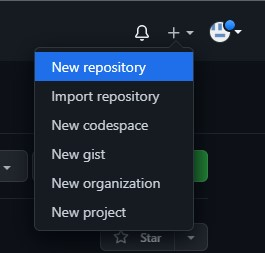
2. Isikan nama, keterangan, serta lisensi. Jika dikehendaki, bisa membuat repo Private
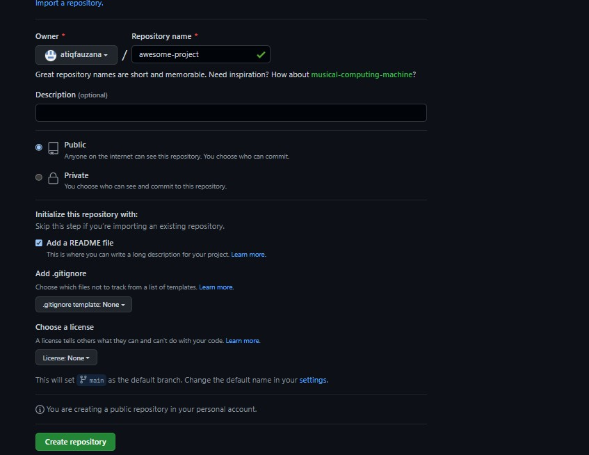

## Clone Repo
Proses clone adalah proses untuk menduplikasikan remote repo di GitHub ke komputer lokal. Untuk melakukan proses clone, gunakan perintah berikut:
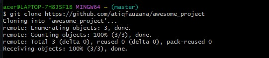
Setelah perintah ini, di direktori awesome-project akan disimpan isi repo yang sama dengan di GitHub. Perbedaannya, di komputer lokal terdapat direktori .git yang digunakan secara internal oleh Git.

Mengelola Repo
Setelah clone ke komputer lokal, semua manipulasi konten dilakukan di komputer lokal dan hasilnya akan di-push ke remote repo di GitHub. Dengan demikian, jangan berganti-ganti remote lokal, sekali dibuat disitu, tetap berada disitu. Jika kehilangan repo lokal, clone ulang ke direktori yang bersih (kosong) setelah itu baru lakukan pengelolaan repo. Beberapa hal yang biasanya dilakukan akan diuraikan berikut ini.

Mengubah Isi - Push Tanpa Branching dan Merging
Perubahan isi bisa terjadi karena satu atau kombinasi beberapa hal berikut:

File dihapus
File diedit
Membuat file / direktori baru
Menghapus direktori
Untuk kasus-kasus tersebut, lakukan perubahan di komputer lokal, setelah itu push ke repo.
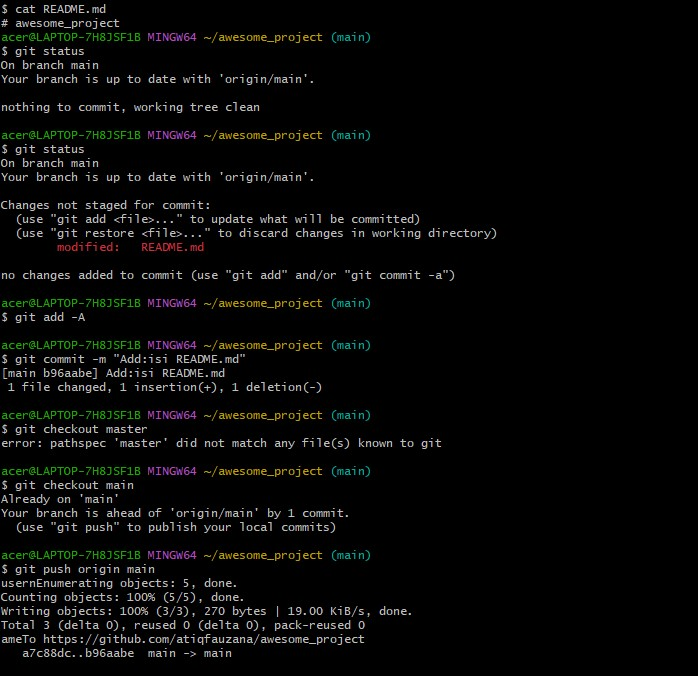
Cara ini lebih mudah tetapi mempunyai resiko jika terjadi kesalahan dalam edit. Cara yang lebih aman tetapi memerlukan langkah yang lebih panjang adalah branching and merging

Mengubah Isi dengan Branching and Merging
Dengan menggunakan cara ini, setiap kali akan melakukan perubaham, perubahan itu dilakukan di komputer lokal dengan membuat suatu cabang yang nantinya digunakan untuk menampung perubahan-perubahan tersebut. Setelah itu, cabang itu yang akan dikirim ke repo GitHub untuk dimintai review kemudian digabungkan (merge) ke master. Secara umum, repo yang dibuat biasanya sudah mempunyai satu branch yang disebut dengan master. Cara ini lebih aman, terstruktur, terkendali, dan mempunyai history yang lebih baik. Jika perubahan yang kita buat sudah terlalu kacau dan kita menyesal, maka ada cara untuk "membersihkan" repo lokal kita. Secara umum, langkahnya adalah sebagai berikut:

Buat branch untuk menampung perubahan-perubahan
Lakukan perubahan-perubahan
Add dan commit perubahan-perubahan tersebut ke branch
Kembali ke repo master
Buat pull request di GitHub
Merge pull request di GitHub
Merge branch untuk menampung perubahan-perubahan tersebut ke master.
Selesai.
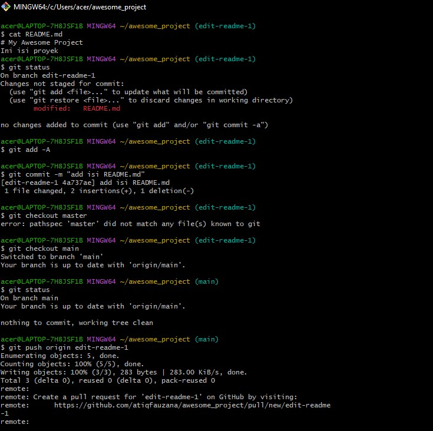
Setelah itu, kirim pull request (PR):
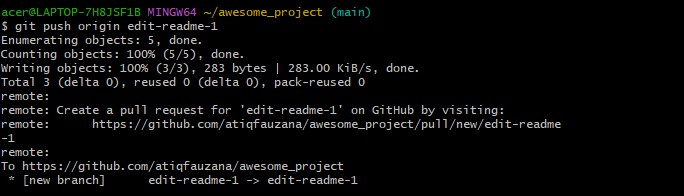
Setelah itu, Confirm Merge, branch yang kita kirimkan tadi sudah dimasukkan ke branch master. Setelah itu, merge di komputer lokal:
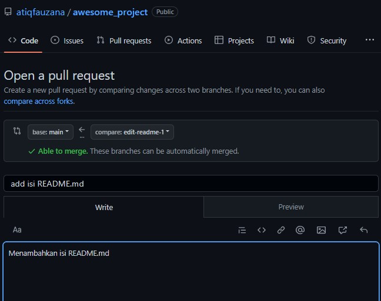

## Sinkronisasi
Suatu saat, bisa saja terjadi kita menggunakan komputer lain dan mengedit repo melalui repo lokal di komputer lain, setelah itu pindah ke kamputer lain lagi. Saat itu, kita perlu melakukan sinkronisasi ke kemputer lokal. Perintah untuk sinkronisasi adalah:

$ git pull
Perintah ini dikerjakan di direktori tempat repo lokal kita berada.

Membatalkan Perubahan
Praktik yang baik adalah membuat branch pada saat kita akan melakukan perubahan-perubahan. Jika perubahan-perubahan yang kita lakukan sudah sedemikian kacaunya, maka kita bisa membuat supaya perubahan-perubahan yang kacau tersebut hilang dan kembali ke kondisi bersih seperti semula.
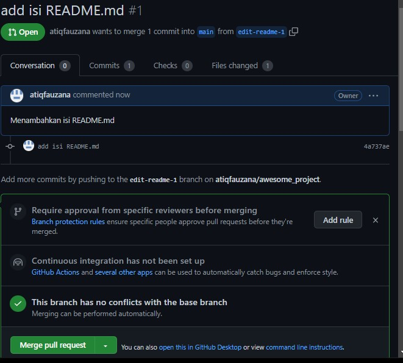

# Undo Commit Terakhir
Suatu saat, mungkin kita sudah terlanjur mem-push perubahan ke repo GitHub, setelah itu kita baru menyadari bahwa perubahan tersebut salah. Untuk itu, kita bisa melakukan git revert.
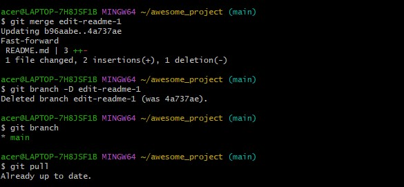
Contoh di atas adalah contoh untuk mengubah README.md dengan beberapa commit. Setelh itu, kita akan mengembalikan ke posisi terakhir sebelum commit terakhir.

$ git revert HEAD
Perintah di atas akan membuka editor. Pada editor tersebut kita bisa mengetikkan pesan revert ( = pesan commit untuk pembatalan). Setelah selesai, simpan:

[master f800ced] Revert "Add: contents - 2"
 1 file changed, 1 deletion(-)
$
Selanjutnya, tinggal di-push ke repo GitHub.
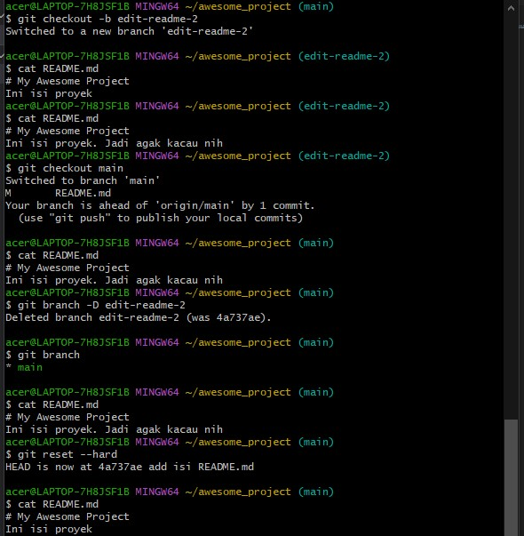
Jika commit sudah dilakukan, tetapi belum di-push ke repo GitHub (masih berada di lokal), cara membatalkannya:
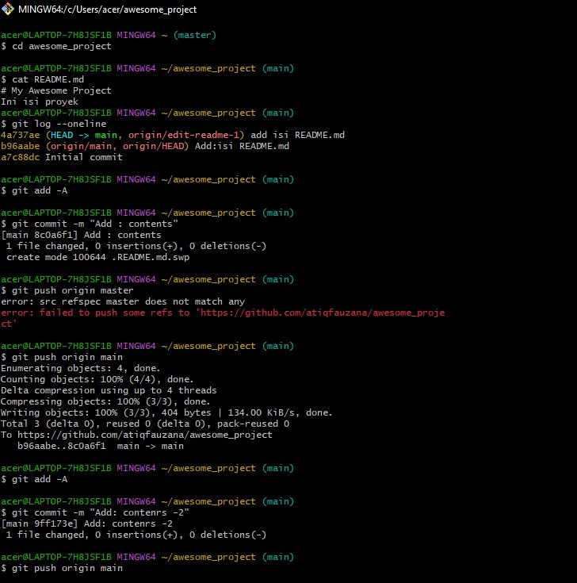
Untuk kembali ke perubahan pada saat yang sudah lama, yang perlu dilakukan adalah melakukan git revert <posisi> kemudian mengedit secara manual kemudian push ke repo.
Setelah itu, jika dilihat pada file, akan muncul tambahan untuk memudahkan meng-edit. File ini harus di-resolve terlebih dahulu, setelah itu baru di add dan commit:
Edit file tersebut, setelah itu simpan.
Setelah itu, lanjutkan proses revert. Saat git revert --continue isikan pesan revert. 

