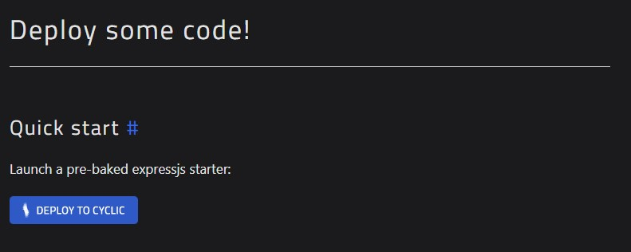
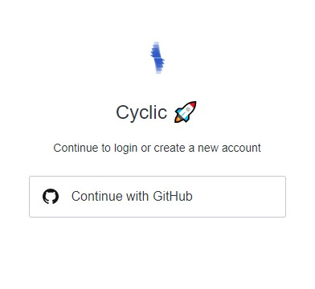
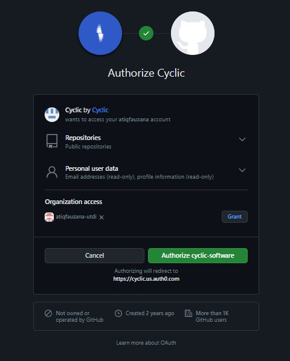
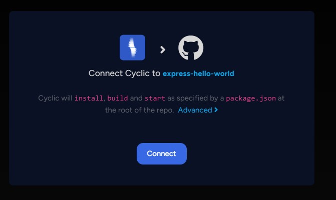
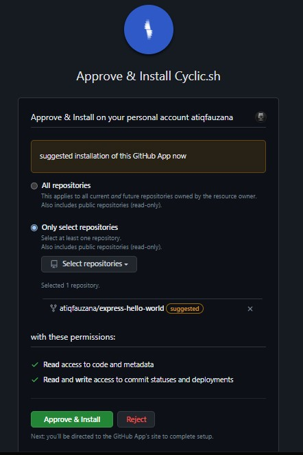
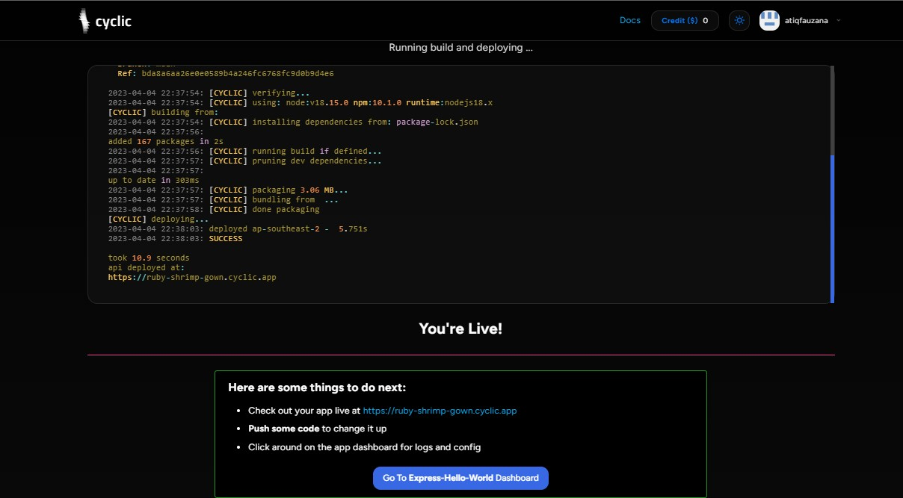
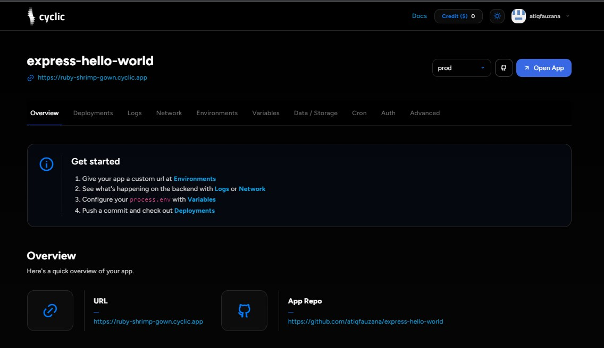

Quick start
Launch a pre-baked expressjs starter:

pilih deploy to cyclic

lalu continue with Github

authorize cyclic software

connect

Approve&install

Go To Express-Hellow-World Dasboard

Tampilan Expres hellow world

