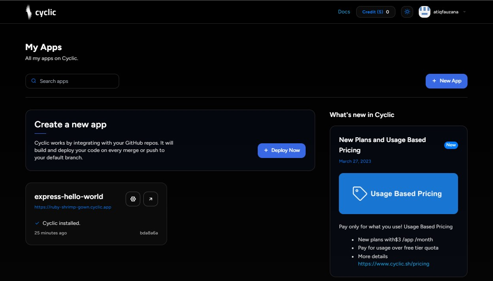
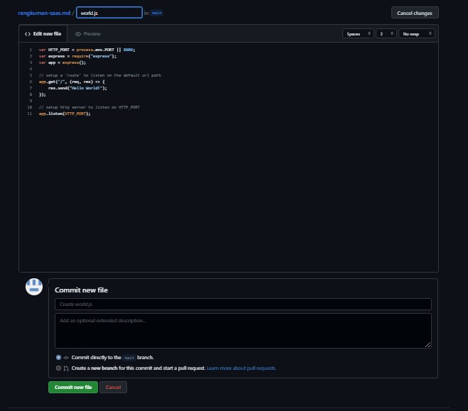
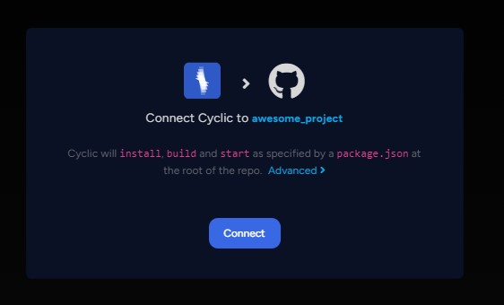
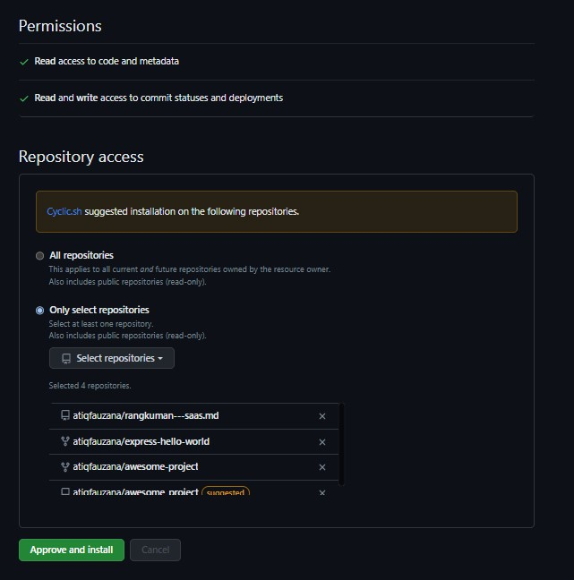

DIY
You can always link your own repository from github.

Sign up: https://app.cyclic.sh/api/login

Using github as your login

Choose "Link my own", and type in your repo name

Click deploy

Approve "Cyclic - Preview" app in github

Watch the terminal for your deployment logs

